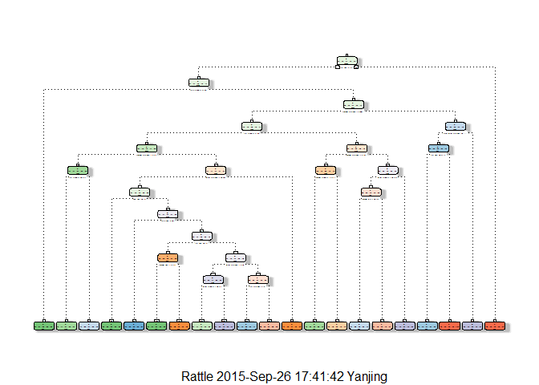

# Practical Machine Learning Project
##Background
Using devices such as Jawbone Up, Nike FuelBand, and Fitbit it is now possible to collect a large amount of data about personal activity relatively inexpensively. These type of devices are part of the quantified self movement - a group of enthusiasts who take measurements about themselves regularly to improve their health, to find patterns in their behavior, or because they are tech geeks. One thing that people regularly do is quantify how much of a particular activity they do, but they rarely quantify how well they do it. In this project, your goal will be to use data from accelerometers on the belt, forearm, arm, and dumbell of 6 participants. They were asked to perform barbell lifts correctly and incorrectly in 5 different ways. 


##Loading libraries

```r
library(caret)
```

```
## Warning: package 'caret' was built under R version 3.1.3
```

```
## Loading required package: lattice
```

```
## Warning: package 'lattice' was built under R version 3.1.3
```

```
## Loading required package: ggplot2
```

```
## Warning: package 'ggplot2' was built under R version 3.1.3
```

```r
library(lattice)
library(ggplot2)
library(randomForest)
```

```
## Warning: package 'randomForest' was built under R version 3.1.3
```

```
## randomForest 4.6-10
## Type rfNews() to see new features/changes/bug fixes.
```

```r
library(rpart)
```

```
## Warning: package 'rpart' was built under R version 3.1.3
```

```r
library(rpart.plot)
```

```
## Warning: package 'rpart.plot' was built under R version 3.1.3
```

```r
library(rattle)
```

```
## Warning: package 'rattle' was built under R version 3.1.3
```

```
## Loading required package: RGtk2
```

```
## Warning: package 'RGtk2' was built under R version 3.1.3
```

```
## Rattle: A free graphical interface for data mining with R.
## Version 3.5.0 Copyright (c) 2006-2015 Togaware Pty Ltd.
## Type 'rattle()' to shake, rattle, and roll your data.
```

#Read Data File

```r
trainingData <-read.csv("pml-training.csv", na.strings=c("#DIV/0!"," ", "", "NA", "NAs", "NULL"))
testingData <-read.csv("pml-testing.csv", na.strings=c("#DIV/0!"," ", "", "NA", "NAs", "NULL"))
dim(trainingData); dim(testingData)
```

```
## [1] 19622   160
```

```
## [1]  20 160
```

```r
set.seed(12345)
#Partion Training Data into 2 data sets; 70% for Training, 30% for Testing:
trainingP <-createDataPartition(trainingData$classe, p=0.7, list=FALSE)
training <-trainingData[trainingP,]
testing <-trainingData[-trainingP,]
dim(training);dim(testing)
```

```
## [1] 13737   160
```

```
## [1] 5885  160
```
##Data Cleansing

```r
# Remove irrelevant columns 1 to 7 "user_name","raw_timestamp_part_1","raw_timestamp_part_2","cvtd_timestamp","new_window","num_window",
trainingCleanse <-training[, -(1:7)]
dim(trainingCleanse)
```

```
## [1] 13737   153
```

```r
# Remove vairables with Near Zero Variance
nzvTraining <-nearZeroVar(trainingCleanse, saveMetrics=TRUE)
training <-trainingCleanse[,!nzvTraining$nzv]
dim(training)
```

```
## [1] 13737   124
```

```r
# Remove col with more than 60% NA values
colRemove <-vector()
j <- 0
for(i in 1:ncol(training)){
  if((sum(is.na(training[,i]))/nrow(training))>=0.60){
    j<-j+1
    colRemove[j]<-i
  }
}
training <-training[,-colRemove]
dim(training)
```

```
## [1] 13737    53
```
#Prediction Model - Decision Tree

```r
pModel1 <-rpart(classe ~ ., data=training, method="class")

#Plot
fancyRpartPlot(pModel1)
```

 

```r
#Predict
pModelD <-predict(pModel1, testing, type = "class") 

#Using confusion Matrix to test result on testing data 
confusionMatrix(pModelD, testing$classe)           
```

```
## Confusion Matrix and Statistics
## 
##           Reference
## Prediction    A    B    C    D    E
##          A 1498  196   69  106   25
##          B   42  669   85   86   92
##          C   43  136  739  129  131
##          D   33   85   98  553   44
##          E   58   53   35   90  790
## 
## Overall Statistics
##                                           
##                Accuracy : 0.722           
##                  95% CI : (0.7104, 0.7334)
##     No Information Rate : 0.2845          
##     P-Value [Acc > NIR] : < 2.2e-16       
##                                           
##                   Kappa : 0.6467          
##  Mcnemar's Test P-Value : < 2.2e-16       
## 
## Statistics by Class:
## 
##                      Class: A Class: B Class: C Class: D Class: E
## Sensitivity            0.8949   0.5874   0.7203  0.57365   0.7301
## Specificity            0.9060   0.9357   0.9097  0.94717   0.9509
## Pos Pred Value         0.7909   0.6869   0.6273  0.68020   0.7700
## Neg Pred Value         0.9559   0.9043   0.9390  0.91897   0.9399
## Prevalence             0.2845   0.1935   0.1743  0.16381   0.1839
## Detection Rate         0.2545   0.1137   0.1256  0.09397   0.1342
## Detection Prevalence   0.3218   0.1655   0.2002  0.13815   0.1743
## Balanced Accuracy      0.9004   0.7615   0.8150  0.76041   0.8405
```
#Prediction Model - Random Forest

```r
pModel2 <-randomForest(classe ~., data=training, method="class")

#Predict
pModelF <-predict(pModel2, testing, type = "class")

#Using confusion Matrix to test result on testing data 
confusionMatrix(pModelF, testing$classe)
```

```
## Confusion Matrix and Statistics
## 
##           Reference
## Prediction    A    B    C    D    E
##          A 1673    9    0    0    0
##          B    1 1127   13    0    0
##          C    0    3 1011   14    0
##          D    0    0    2  949    5
##          E    0    0    0    1 1077
## 
## Overall Statistics
##                                          
##                Accuracy : 0.9918         
##                  95% CI : (0.9892, 0.994)
##     No Information Rate : 0.2845         
##     P-Value [Acc > NIR] : < 2.2e-16      
##                                          
##                   Kappa : 0.9897         
##  Mcnemar's Test P-Value : NA             
## 
## Statistics by Class:
## 
##                      Class: A Class: B Class: C Class: D Class: E
## Sensitivity            0.9994   0.9895   0.9854   0.9844   0.9954
## Specificity            0.9979   0.9971   0.9965   0.9986   0.9998
## Pos Pred Value         0.9946   0.9877   0.9835   0.9927   0.9991
## Neg Pred Value         0.9998   0.9975   0.9969   0.9970   0.9990
## Prevalence             0.2845   0.1935   0.1743   0.1638   0.1839
## Detection Rate         0.2843   0.1915   0.1718   0.1613   0.1830
## Detection Prevalence   0.2858   0.1939   0.1747   0.1624   0.1832
## Balanced Accuracy      0.9986   0.9933   0.9909   0.9915   0.9976
```

#Analysis Result
From the above, we can conclude that Random Forest provides a better accuracy in testing dataset of 99.25%, in comparison to Decision Tree. When comes to the expected out-of-sample error, Random Tree is (100-99.25) = 0.75%.


#Test set prediction

```r
final <- predict(pModel2, testingData, type="class")
ans <- as.vector(final)

pml_write_files = function(x){
  n = length(x)
  for(i in 1:n){
    filename = paste0("problem_id_",i,".txt")
    write.table(x[i],file=filename,quote=FALSE,row.names=FALSE,col.names=FALSE)
  }
}

pml_write_files(ans)
```
